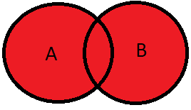
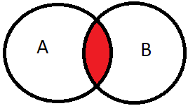

### Sets And Types

* Types are sets:
    * `{ foo: number }` - the set of all values that are objects and have a `foo` property of type `number`
    * `{ bar: number }` - the set of all values that are objects and have a `bar` property of type `number`
    * `number` - the set of all values that are floating point numbers
    * `string`- the set of all values that are strings
    * `never`-  the empty set, no value can inhabit this set
    * `unknown` - the set of all possible values 

----

### Object type as sets 

* `{ foo: number }` - What values are in this set 
    * `{ foo: 1 }`
    * `{ foo: 1, bar: 2 }`
* Object types are a description of the minimal requirements of an object
* Objects with more defined properties are subsets of types with fewer properties
* Excess property checks are a useful pragmatic exception to usual typing rules

----

### Set operations can be applied to types

* Unions:
    * Same concept as set unions 
    * `{ foo: number } | { bar: number }` the set of all objects that either
        * have a `foo` property of type `number`
        * have a `bar` property of type `number`
    * `string | number` the set of values that are either numbers or strings 

---

### Set operations can be applied to types

* Intersections:
    * Same concept as set intersections 
    * `{ foo: number } & { bar: number }` the set of all objects that at the same time:
        * have a `foo` property of type `number`
        * have a `bar` property of type `number`
    * `number & string` the set of all values that are both `number` and `string`
        * This is the empty set, so it will reduce to `never`

---

### Unions - Representing options

<question>

How can I represent an object that is either a `Engineer` or a `Doctor`?
```ts
interface Engineer { name: string; age: string; field: string }
interface Doctor { name: string; age: string; speciality: string }
```

</question>

<answer>

Use a union

</answer>

---

### Type Guards - Narrowing unions

<question>

Why can't I access some union properties?

</question>

<answer>

You can only safely access common properties. You need to narrow the type of a union

</answer>

--- 

### Type Guards - Narrowing unions

* Syntactic constructs that help us narrow a union
* To narrow the `value` variable:
    * `'property' in value`  - the `in` type guard
    * `typeof value === 'valid type'` - the `typeof` type guard

