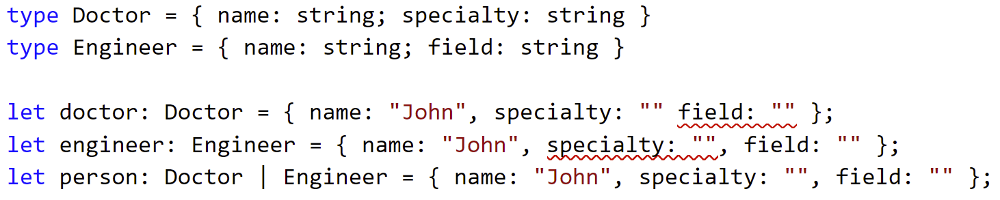

### Discriminated unions 
<question> 

Why does my union allow properties from any union constituent?
 

</question>

<answer>

By design. Use a discriminated union

</answer>

----

### About discriminated unions 

* A property is considered as a discriminant property if:
    * A union of literal types
    * It is a union type containing at least one literal type

----

### Type Guards - Narrowing unions

- Syntactic constructs that help us narrow a union
- To narrow the `value` variable:
    - `'property' in value`  - the `in` type guard
    - `typeof value === 'valid type'` - the `typeof` type guard
    - `value === constant`, `value !== constant`, `!value`, `value` expressions in `if` statements
    - `switch(value)` statements

---

### Type Guards - Narrowing discriminated unions

* To narrow the `obj` value that is discriminated by `type`:
    * `obj.type === constant`, `obj.type !== constant`, `!obj.type`, `obj.type` expressions in `if` statements
    * `switch(obj.type)` statements
