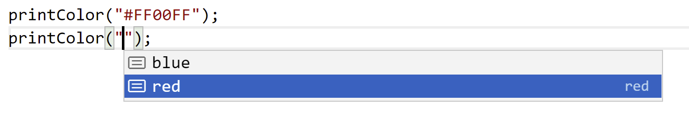

### Intersection And Union Reduction

<question>

If I have a union `"yes" | "no" | 0 | 1` how can I get the `string` or `number` constituents?

</question>
<answer>

Use an intersection

</answer>

----

### Intersection And Union Reduction -  Rules

* `("yes" | "no" | 0 | 1) & string`
* Intersection goes on the inside
    * `("yes" & string) | ("no" & string) | (0 & string) | (1 & string)`
* Some intersections are uninhabitable by any value so reduce to `never`
    * `("yes" & string) | ("no" & string) | never | never` 

---

### Intersection And Union Reduction -  Rules

- `("yes" | "no" | 0 | 1) & string`
- `("yes" & string) | ("no" & string) | (0 & string) | (1 & string)`
- `("yes" & string) | ("no" & string) | never | never` 
* Subtype reduction: 
    * If `D` is a sub set `P` then `D & P` is `D`
      <svg width="200" height="200" viewbox="-5,-5,105,105" style="position: absolute;right:400;bottom: 150"><circle cx="50" cy="50" r="50" stroke="darkblue" stroke-width="1" fill="lightblue" /><circle cx="60" cy="60" r="25" stroke="darkblue" stroke-width="1" fill="#099ffc" /><text font-size="30" font-family="monospace" x="50" y="75">D</text><text font-size="30" font-family="monospace" x="20" y="35">P</text></svg>
    * `"yes" | "no" | never | never` 


---

### Intersection And Union Reduction -  Rules

- `("yes" | "no" | 0 | 1) & string`
- `("yes" & string) | ("no" & string) | (0 & string) | (1 & string)`
- `("yes" & string) | ("no" & string) | never | never`
- `"yes" | "no" | never | never` 
* `never` is removed from a union
    * A union with an empty set does not change the other set 
    * `"yes" | "no"` 

---

### Filtering out object types

<question>

Given a discriminated union, how can we filter out a specific union constituent?

```ts
type Person = {
    type: "e"; name: string; field: string
} | {
    type: "d"; name: string; speciality: string
}
type Doctor = { type: "d"; name: string; speciality: string }
```
</question>

<answer>

Use an intersection

</answer>

----

### Filtering out object types

- Intersections that result in `never` properties are reduced to `never`

```ts
type Doctor =  { type: "x"} & {
    type: "d"
    name: string;
    age: string;
    speciality: string
} /* = never */
```

---

### Some strings preferred 

<question>

Can I offer some completions on a string value?
<br/>



</question>
<answer>

Naive answer: `string | "red" | "blue"`

</answer>

---

### Intersection And Union Reduction -  Rules

* `string  | "red" | "blue"`
* Subtype reduction: 
    * If `D` is a sub set `P` then `D | P` is `P`
      <svg width="200" height="200" viewbox="-5,-5,105,105" style="position: absolute;right:400;bottom: 150"><circle cx="50" cy="50" r="50" stroke="darkblue" stroke-width="1" fill="lightblue" /><circle cx="60" cy="60" r="25" stroke="darkblue" stroke-width="1" fill="#099ffc" /><text font-size="30" font-family="monospace" x="50" y="75">D</text><text font-size="30" font-family="monospace" x="20" y="35">P</text></svg>
    * `string`